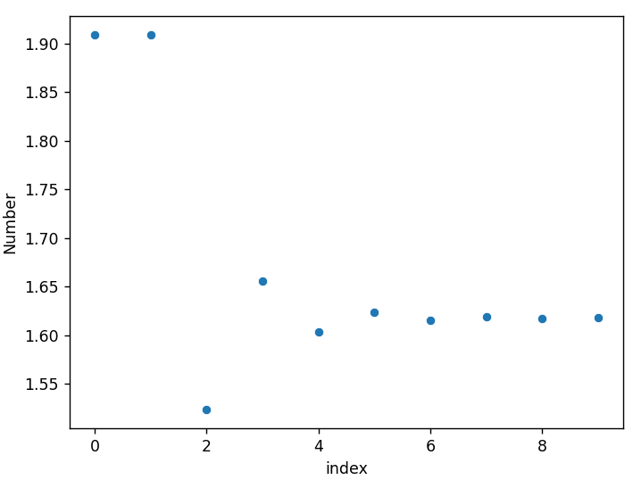

# Dungeon Numbers
[Dungeon numbers](https://www.youtube.com/watch?v=xNx3JxRhnZE) are numbers that arise when we interpret a subscript $a_b$ as meaning $a$ in base $b$ and then make a long chain of sub-subscripts. This repository contains a basic implementation of dungeon numbers. 

The function `dungeonNumber()` may either be called with a sequence of numbers, as in `dungeonNumber(10, 11, 12, 13, 14, 15)` (meaning $10_{11_{12_{13_{14_{15}}}}}$), or it may be called by first defining `numbers = [10, 11, 12, 13, 14, 15]` and then calling `dungeonNumber(numbers)`. 

The sequences computed in the Numberphile and as the output of this script are as follows: \
`10, 11, 13, 16, 20, 25, 31, 38, 46` \
`10, 11, 13, 16, 20, 25, 31, 38, 46` \
`10, 11, 13, 16, 20, 30, 48, 76, 132` \
`10, 11, 13, 16, 20, 28, 45, 73, 133`

# Computation of the Golden Ratio
When we compute the `dungeonNumber` of a list of $n$ 1.1's as $n \to \infty$, we see that the value approaches the Golden Ratio 1.618033988749895 rather quickly. 

A scatterplot of 10 values

A scatterplot of 50 values
