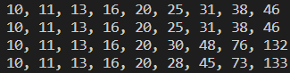

# Dungeon Numbers
Dungeon numbers are numbers that arise when we interpret a subscript $a_b$ as meaning $a$ in base $b$ and then make a long chain of sub-subscripts. See more [here](https://www.youtube.com/watch?v=xNx3JxRhnZE). This repository contains a basic implementation of dungeon numbers. 

